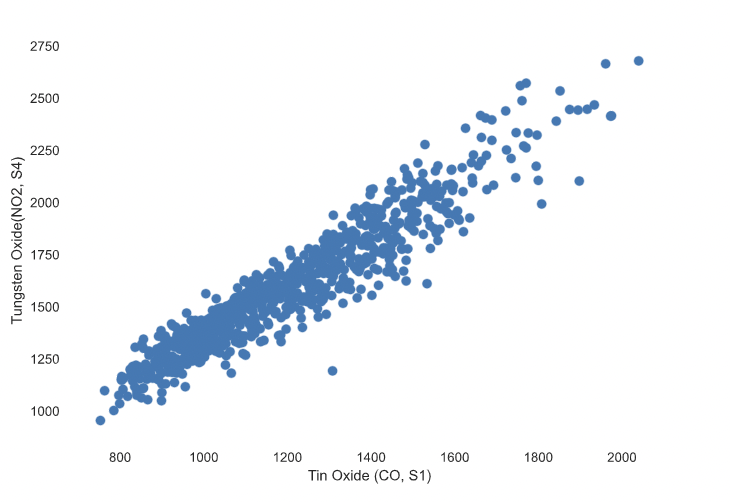
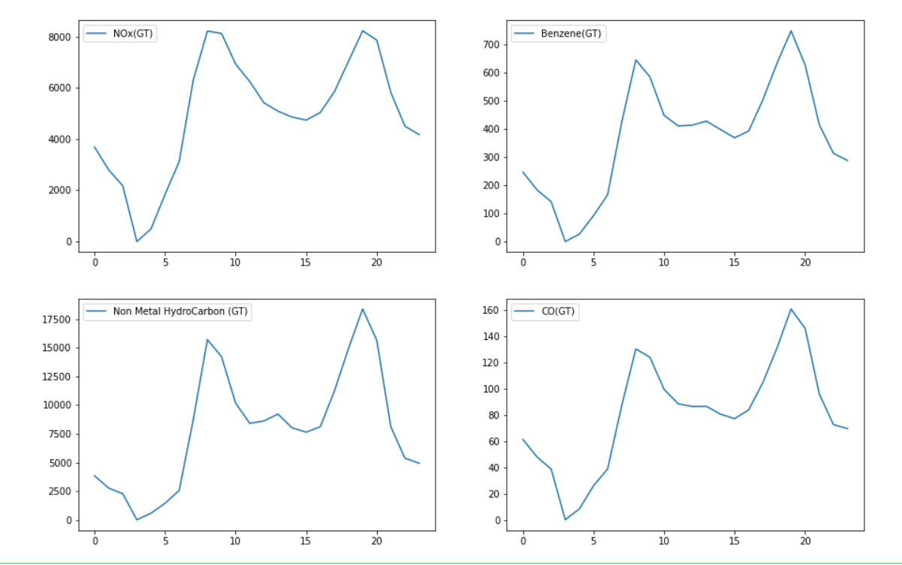
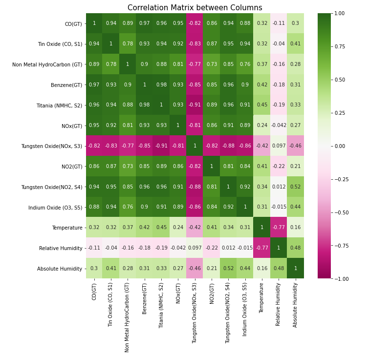

# Analysis
-----------

## Reasearch Questions
======================

**Increased and prolonged exposure to high levels of toxic gasses lead to cancer. This is a concern in urban cities, as automotive vehicles emit such gasses and pollute causing adverse effects to the human body.**

1. Pollution increases at certain times in the day, and at these high traffic times, high levels of pollutants are detected within    the sensors.

2. This is a daily occurrence, therefore prolonged exposure to these gasses will lead to harmful lung diseases.
   [[5]](https://pubmed.ncbi.nlm.nih.gov/29448164/)
   “*After repeated inhalation, In2O3 particles accumulate in the lungs. Their mobilization can cause significant systemic exposure    over long periods of time.* “
   
   “*Mechanistic toxicological studies show that TiO(2) nanoparticles predominantly cause adverse effects via induction of oxidative    stress resulting in cell damage, genotoxicity, inflammation, immune response etc. The extent and type of damage strongly depends    on physical and chemical characteristics of TiO(2) nanoparticles, which govern their bioavailability and reactivity. Based on      the experimental evidence from animal inhalation studies TiO(2) nanoparticles are classified as "possible carcinogenic to          humans*”[[4]](https://pubmed.ncbi.nlm.nih.gov/22933961/)

3. The large concentrations of nitrogen dioxide (NO2) can be attributed to its presence along with carbon monoxide (CO) and other harmful gases, as a result of vehicle emissions that contribute to the greenhouse effect. The correlation with the high concentration of gases and temperature further helps support this analysis of data. Moving forward we would like to see how this varies based on the time of day, and between seasons. This will help us connect the dots between the air quality in the city and vehicle contributions.As shown in the figure below, the toxic gasses are emitted mostly in the day and mid afternoon times. Roughly around when people are going to and back from work. Throughout during these times of day, people are exposed to higher concentrations of such gasses.

4. As humidity increases breathing rates increases along with higher concentraton of toxic gases, therefore higher accumulations of toxins in the body, this can be shown in our correlation matrix as shown below. 

   “*High humidity levels may exacerbate symptoms for a variety of reasons. The body must work harder to breathe when humidity levels are high, especially when the air is hot.*
   Humid air is dense, due to the high water content. This density can increase airway resistance in the body. As a result, breathing may require more effort, which can worsen COPD symptoms, including shortness of breath and fatigue.   
   "*Humid, hot weather also requires the body to work harder to stay cool. Expending this energy requires more oxygen, which can contribute to feelings of breathlessness.*”  [[9]](www.medicalnewstoday.com/articles/323657#can-humidity-trigger-copd-symptoms) 
   This part relates to the previous citations, repeated inhalation of heavy metal gasses lead to faster accumulation and therefore adverse symptoms. 
   

